<h3><code>Mahdi@github ~ $ ./contributions.sh</code></h3>

  

<h3><code>Mahdi@github ~ $ whoami</code></h3>

 

<h3><code>Mahdi@github ~ $ cat contact.txt</code></h3>

  &nbsp;&nbsp;

  &nbsp;&nbsp;

  &nbsp;&nbsp;

  &nbsp;&nbsp;

  

 

